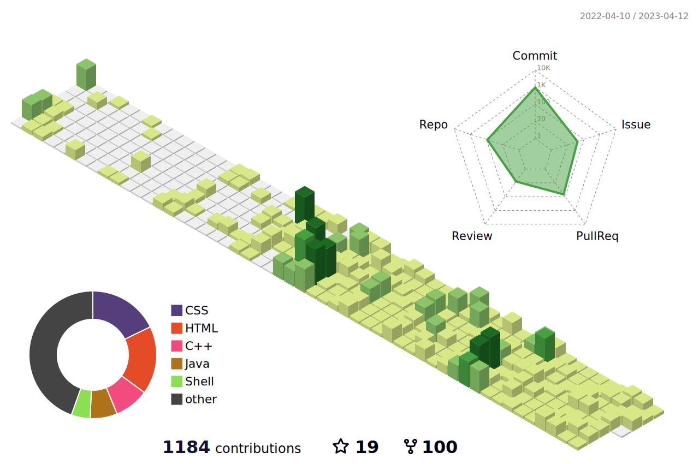

## Hello World 👋 My name is **Utkrishta Sinha**
### I am a Full-Stack MERN Web Developer & a C++ Programmer
#### (which means sometimes I write my own code and sometimes I drink coffee while I copy others' code)

#### I am a final year student, pursuing Bachelor of Technology in Information Technology. With a passion for coding, data structures and algorithms, and web development (MERN stack).
### Skills:
 ##### Programming: C, C++, Python, JavaScript, Java, Git, LaTeX, HTML5, CSS3.
 ##### Libraries & Frameworks: React.js, React Native, Node.js, Express.js, Bootstrap, Mongoose.
 ##### Tools & Platforms: MongoDB,MySQL,Firebase, GitHub, Linux, Windows, Blender‑3D, Figma.
 ##### CourseWork: Data Structures and Algorithms, Computer Networking, Operating Systems, Object Oriented Programming, Database Management System, Object Oriented System Design.

&nbsp;

<!--

&nbsp;&nbsp;
&nbsp;&nbsp;&nbsp;
&nbsp;&nbsp;&nbsp;
&nbsp;&nbsp;
&nbsp;&nbsp;
&nbsp;&nbsp; 
&nbsp;&nbsp;
&nbsp;&nbsp;

<!-- 

      
 --> 

<!-- 

         -->

<!--  Here are some ideas to get you started:

- 🔭 I’m currently working on ...
- 🌱 I’m currently learning ...
- 👯 I’m looking to collaborate on ...
- 🤔 I’m looking for help with ...
- 💬 Ask me about ...
- 📫 How to reach me: ...
- 😄 Pronouns: ...
- ⚡ Fun fact: ...

<!--  <code></code> JavaScript
<code></code>React

  

  
  
 

  
  

-->
